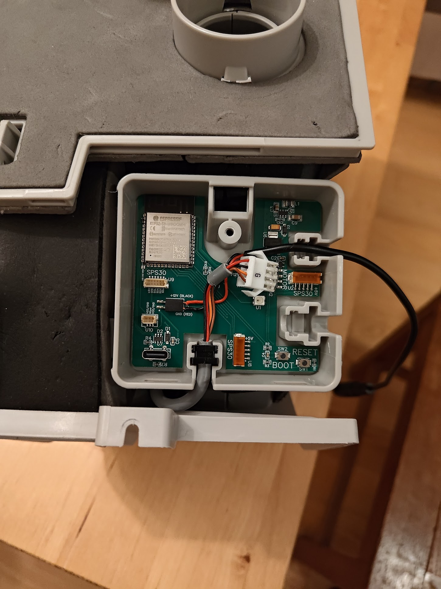
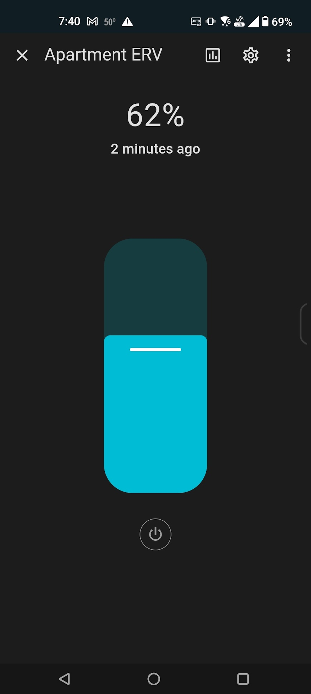

# TOSOT Aoraki and gree Envo ERV controller
This is a control board for the ductless minisplit ERV manufactured by Gree and sold under the TOSOT brand on amazon et al. It uses an ESP32-S3 WROOM1 microcontroller. 


The ERV is provided with 12V from the minisplit (unknown if this is enabled by default) and accepts PWM speed control. 12V is applied via the 2pin female header. I believe the OEM harness can be jammed onto this header. The ERV pulls about 10W at full speed. 


The motor expects 5V amplitude PWM, so the board includes a small amplifier to step the ESP 3.3v output up to 5v. The PWM output pin is attached to **GPIO1**


There is a standard 0.100" pitch pin header provided for the motor connector. The pitch isn't quite wide enough, but it works. A slightly wider pitch would be better. 


There is a 600mA switching regulator circuit to bring the incoming 12V down to 5v for the PWM, and a subsequent linear regulator to bring 5v down to 3.3v for the ESP32. I am not a SMPS designer, so this was generated using Texas Instruments WBENCH. Two of the ten initial PCB's blew up when power was applied, so this circuit should be considered mildly suspect. The generated assets are included in this repo. 600mA was chosen to allow for the power used by 2x particulate sensors and a CO2 sensor on the 5V rail.


There are two 5-pin JST ZH headers made available to connect Sensirion SPS30 particulate sensors, one for inside and one for outside. These devices are factory configured with identical I2C identifiers and therefore cannot share an I2C bus.  
The ESP32S3 can be configured with two I2C busses. These must be configured as follows:  
    **SDA1: GPIO48**  
    **SCL1: GPIO21**  
    **SDA2: GPIO13**  
    **SCL2: GPIO14**  

Bus #1 is attached to the connector nearest the BOOT and RESET buttons. Bus #2 is attached to the connector on the right-side flag below the power circuitry. 

The SPS30 uses the JST ZH conncetor as well, so a straight-through cable should work correctly. 


There is also a 6pin SH header provided for a Sensirion SCD30 CO2 sensor. This shares I2C bus #2. The SCD30 includes pullup resistors, and this may require that the external pullup resistors on the PCB be removed. This can be done by severing the two exposed traces on the bottom of the board, or by depopulating the two associated pullup resistors. The SCD30 includes a "ready" pin, which is attached to **GPIO12**


Also included is a 3pin JST SH header intended for a potentiometer if that's your preferred input device (If, for example, you intend to use it as a standalone device). 0/3.3V should be applied to the outer two pins, and the wiper should be connected to the center pin. The wiper is attached to **GPIO11**


There is a USB-C connector using the native ESP32 USB pins. This is intended for programming only. It will power the ESP, but not the ERV motor. I did not route the second pair of "B" data pins, so if it doesn't connect to a computer you may need to flip the USB connector. 


If you build firmware with the ESPHome tool in Home Assistant, the following stub should be included in the YAML:

```
fan:  
  - platform: speed  
    output: apartment_erv_fan_pwm  
    name: "Apartment ERV"  

output:  
  - platform: ledc  
    pin:  
      number: GPIO1  
      inverted: False  
      mode:   
        output: True  
        pullup: False  
    id: apartment_erv_fan_pwm  
    inverted: False  
    min_power: 0.20  
    zero_means_zero: True  
```

And the board type selected as follows:


```
esp32:  
  board: esp32-s3-devkitc-1  
  framework:  
    type: esp-idf  
```







